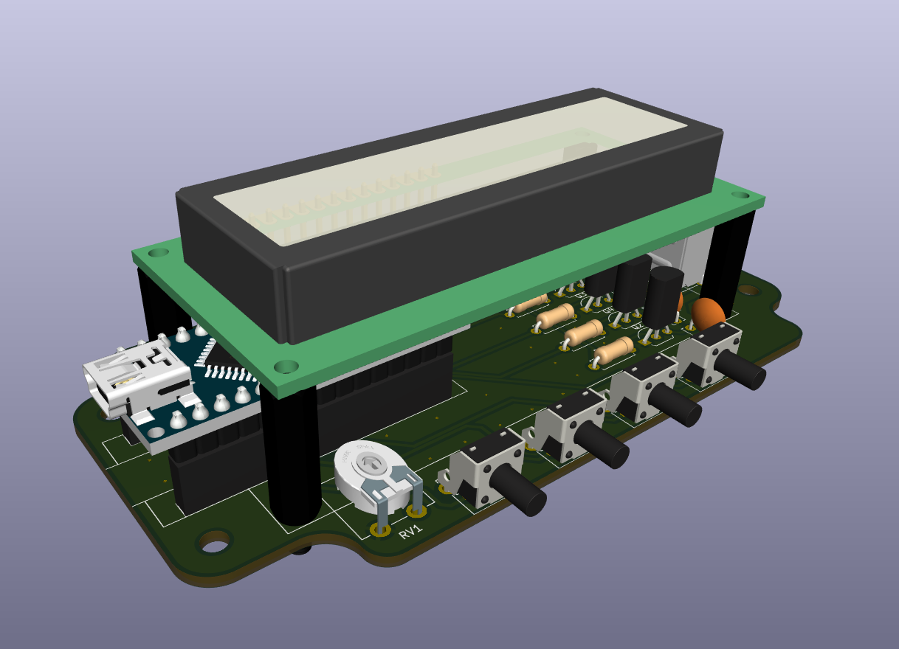
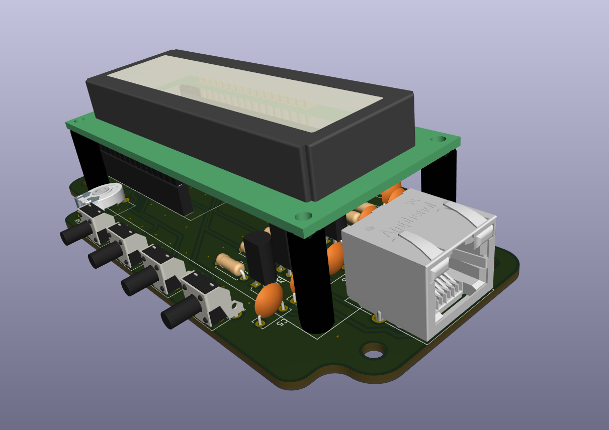

# K3NG-Rotator-Controller
It is a control card using Arduino Nano created for the K3NG Rotor Controller project.

Specially designed for the box in the link (https://www.altinkaya.com/tr/shop/se-035-ip-67-contali-kutu-961#attr=13295,26883,13297,13300,13311,13302)

# Images

